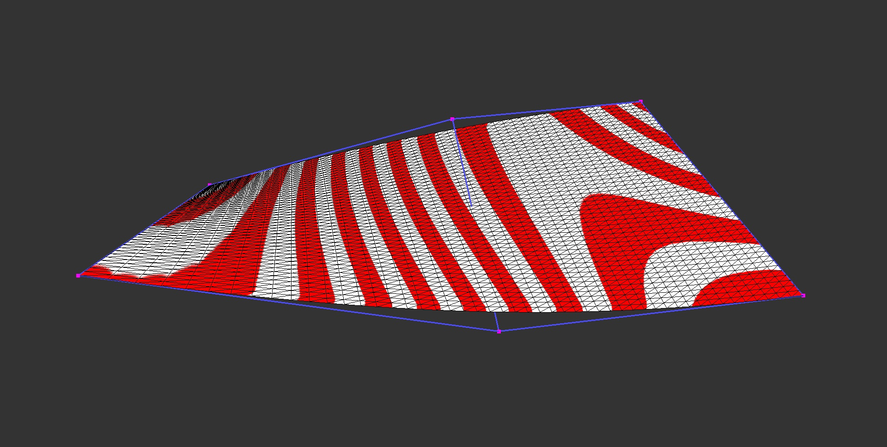
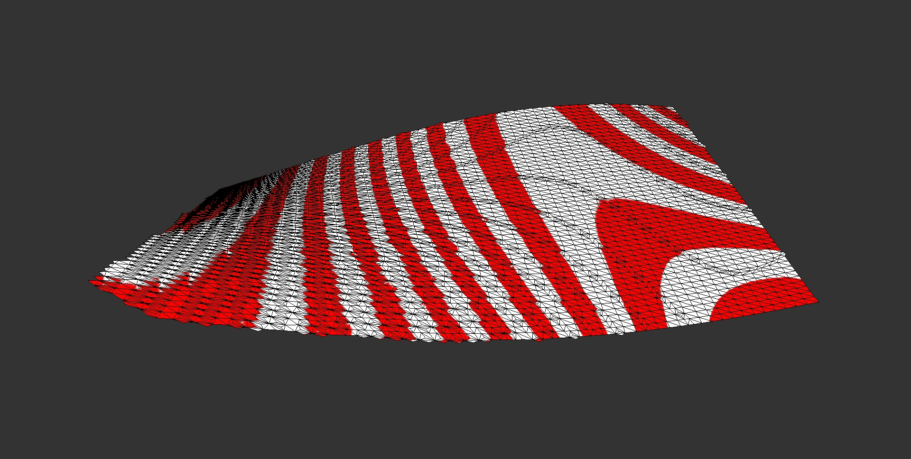

# Implicitize

Implicitization of polynomial curves & surfaces

Exact implicitization based on the classic paper of
[Sederberg et al](https://doi.org/10.1016/0734-189X(84)90140-3)
is implemented in `implicitize.jl`.
It generates a [Maxima](https://maxima.sourceforge.io/) program
to handle symbolic computations and generate, in turn,
the implicit equation based on the Bézier control points.
(See also usage notes in the source.)

As an example, here's the quadratic-by-linear Bézier surface in `test.bzr`:

This is implicitized by the above method, and tessellated by
[dual contouring](http://github.com/salvipeter/dual-contouring/) in `implicitize-test.cc`:

There is also an alternative quasi-implicitization method 
called [M-reps](https://doi.org/10.1016/j.cad.2013.08.014),
implemented in `mrep.jl`,
where curves as well as triangular and tensor product Bézier surfaces
are represented as matrices; evaluation involves a singular value decomposition.
See also my note on normalization in `mrep-normalization.pdf`.
